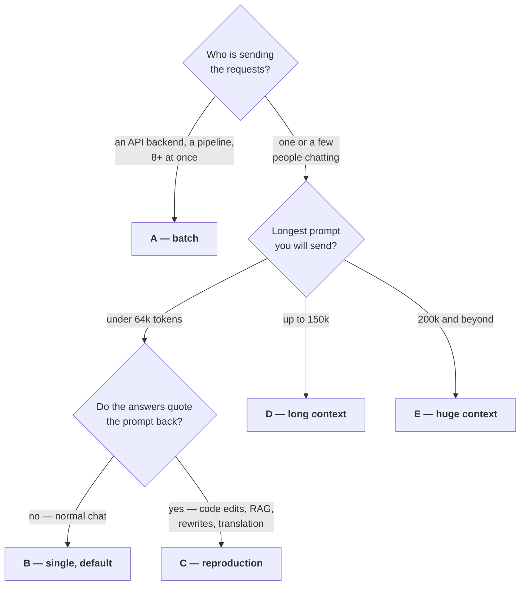

<div align="center">

<h1>HyperQwen</h1>

<p><b>Large Qwen models, served fast on the GPUs people actually own.</b></p>

<p>
<a href="https://github.com/syv-ai/HyperQwen/actions/workflows/docker-image.yml"></a>
<a href="https://github.com/syv-ai/HyperQwen/actions/workflows/patch-integrity.yml"></a>
<a href="https://github.com/syv-ai/HyperQwen/pkgs/container/hyperqwen"></a>
<a href="https://github.com/vllm-project/vllm"></a>
<a href="LICENSE"></a>
<a href="https://github.com/syv-ai/HyperQwen/stargazers"></a>
<a href="https://ko-fi.com/mhenrichsen"></a>
</p>


</div>

**Today:** [Qwen3.8-27B](https://huggingface.co/Qwen/Qwen3.8-27B) on a single 24 GB
consumer GPU with vLLM — 150k token context and an OpenAI-compatible API with key
auth, in two ready-made modes. On an RTX 3090 at 250 W: 127 tok/s single-stream
in single-user mode, ~1,035 tok/s aggregate decode at 64 concurrent in batch mode,
and 381 tok/s when the answer quotes its own prompt.

**Where it is going:** more Qwen models, more classes of card. What this repo
really is, under the serving setup, is a patch series against a pinned vLLM plus
a model-preparation pipeline — requantized heads, a calibrated draft vocabulary,
speculation that drafts out of the prompt. Most of that is not specific to one
checkpoint or one card; it is just that one checkpoint and one card are what has
been measured to death. See [Roadmap](#roadmap-more-qwen-models-more-cards) for
what is and is not portable yet, and
[Field tests wanted](#field-tests-wanted) if you have half an hour on a GPU we
have never touched.

## Quick start

```bash
git clone https://github.com/syv-ai/HyperQwen && cd HyperQwen
cp .env.example .env                      # PowerShell: Copy-Item .env.example .env

docker compose --profile single up -d     # one or a few people chatting
docker compose --profile batch  up -d     # API backend, many concurrent requests
```

First start pulls the image (9.5 GB) and requantizes the model (~20 GB, once,
into `./models`), then serves on `:18020`. One GPU runs one mode at a time.

- **Before exposing it** — the server binds `0.0.0.0` with no auth:
  `echo "VLLM_API_KEY=$(openssl rand -hex 24)" > .env`
- **Docker Desktop on WSL2** — keep `VLLM_WSL2_ENABLE_PIN_MEMORY=1` in `.env`, or
  the V2 runner aborts with `RuntimeError: UVA is not available`
- **No compose, or no Docker at all** —
  [docs/docker.md](docs/docker.md#plain-docker-no-compose) ·
  [docs/install.md](docs/install.md)

## Which setup do I want?

Three questions, and the answers are the whole of your `.env`.



Starting from the `.env` you copied in Quick start, which already ships **B**:

| | change in `.env` | start with | what you get |
|---|---|---|---|
| **A** | nothing | `--profile batch` | ~1,035 tok/s aggregate at 64 concurrent |
| **B** | nothing | `--profile single` | 127 tok/s single stream, 64k context |
| **C** | add `DFLASH_TOKENS=15` | `--profile single` | 381 tok/s while quoting, at 4 slots and 56k |
| **D** | `SPEC=mtp` and `CTX=long` | `--profile single` | 150k context, ~95-100 tok/s |
| **E** | add `CTX=huge` | `--profile single` | 240k context, 67 tok/s mixed and 164 while quoting |

Torn between B and C: B is the safe default, and C only pays off when the output
really does repeat the input — it trades request slots and context for it. D drops
back to MTP speculation on purpose, because DFlash2 past 64k is worth it only for
reproduction and loses to `SPEC=mtp CTX=long` about 2:1 on everything else; at E
the KVarN cache buys the context instead, so DFlash2 stays on. A needs no edit at
all — batch ignores `SPEC` and says so on startup. Every knob, and what each costs:
[single-user/README.md](single-user/README.md#if-you-are-the-only-user-do-this) ·
[batch/README.md](batch/README.md).

### The numbers behind that

| | **batch** → [batch/](batch/) | **single** → [single-user/](single-user/) |
|---|---|---|
| **best for** | API backends, pipelines, many concurrent requests | one or a few people chatting |
| **64 concurrent** (128 in / 512 out) | **~1,035 tok/s** decode, 948 e2e — ~1,222 with every layer int8 | n/a — 8 slots |
| **single stream** (C1) | 46 tok/s | **127 tok/s** — 121 on the older MTP path |
| **quoting its own prompt** | 46 tok/s | **381 tok/s** at 25k context |
| **prefill**, 1k in | ~1,810 tok/s | ~1,440 — **~1,850-1,940** with `INT8_ACT=int8` |
| **how** | 16-bit recurrent state, int8 tensor-core GEMMs | 7 drafts proposed per pass, 15 tokens verified per step off the context |

Speculation wins below ~8 concurrent users, plain batching above — earlier on long
sessions, where a speculating request reserves recurrent-state pages the pool has
few of ([measurement](docs/long-context.md)). Both modes share one install.
[Full prefill matrix](batch/README.md#prefill) ·
[how each number was won](docs/optimizations.md).

## Roadmap: more Qwen models, more cards

The name changed because the scope did. This started as "Qwen3.8-27B on one RTX
3090" and the README still reflects that, because that is the pair which has been
measured properly. The plan is to widen both axes. Being specific about what
transfers, since "supports N models" is easy to claim and expensive to be wrong
about:

**Portable already — nothing model- or card-specific in it.** The vLLM patch
series (`patches/`, 38 files, one line each in [PATCHES.md](PATCHES.md)), the
KVarN long-context backend, int8 Marlin GEMM layer selection, the SSE keep-alive,
the engine stall sentinel. These are vLLM fixes that happen to have been written
here.

**Model-specific, and this is the real work.** The int8-QK prefill attention
kernel is gated on this checkpoint's exact geometry — `num_heads == 24`,
`num_kv_heads == 4`, `head_size == 256` — and falls back to FA2 for anything
else, so a new model gets correctness for free and none of the prefill win until
the gate is generalized. The 40k-token draft vocabulary is calibrated on this
model's own output distribution. The DFlash2 drafter is a per-model checkpoint.
`prepare/` assumes a head layout that only just learned to handle heads in
different shards ([#120](https://github.com/syv-ai/HyperQwen/issues/120)).

**Card-specific.** The Marlin tune tables are measured on sm86. sm120 (RTX 5090)
reproduces ([#35](https://github.com/syv-ai/HyperQwen/issues/35)); sm80 runs but
has an open speculation fault at any k
([#98](https://github.com/syv-ai/HyperQwen/issues/98),
[#72](https://github.com/syv-ai/HyperQwen/issues/72)). Multi-GPU works at TP=2
and TP=4; TP=3 and PP=3 are invalid for this model's head count, which is a
property of the checkpoint rather than a missing feature.

**What we want next.** Smaller Qwen checkpoints so 16 GB and 12 GB cards get the
same treatment rather than a shrug; a larger one for 48 GB; the EXL3 route in
[#103](https://github.com/syv-ai/HyperQwen/issues/103) as a second quantization
path. If you want a specific model or card prioritized, say so in an issue — the
order is mostly driven by who turns up with a reproduction.

## Field tests wanted

Every number above is one RTX 3090 at 250 W, shared with training jobs. Every
row for any other card came from someone else running the harness — so the ask
here is a protocol rather than "try it and let us know".

**About 30 minutes on one GPU**, most of it unattended. The harness lives in
the container, so it runs through `compose exec` — on a venv install drop that
prefix and use `python` instead of `venv/bin/python`:

```bash
sudo nvidia-smi -pl 250                 # your card's reference wattage; say which
docker compose --profile single up -d   # first start also prepares the model

docker compose exec single bash bench/run_benchmarks.sh single   # discard: a first run after a start reads 30-50% low
docker compose exec single bash bench/run_benchmarks.sh single   # keep this one — its ROW lines are the report

docker compose exec single venv/bin/hf download openai/gsm8k --repo-type dataset \
  --include "main/test-*" --local-dir bench/quality-data/gsm8k
docker compose exec single venv/bin/pip install pyarrow   # only on images published before 2026-09-21
docker compose exec single venv/bin/python bench/quality_battery.py mycard --gsm-only
```

Then open a
[field report](https://github.com/syv-ai/HyperQwen/issues/new?template=field-report.yml).
The form asks for the six things that make two runs comparable — card, power
cap, driver, OS or container, commit, which setup letter — because without them
a number cannot honestly be put next to the row above it. Ran something
narrower, or with your own client? Post it anyway and say what you skipped; it
gets listed as an independent report instead of a table row, which is what
happened to most of
[docs/reproductions/](docs/reproductions/README.md#results-from-other-hardware).

**Most wanted, in order.** Several of these already have a thread with someone's
hardware in it — check before you duplicate, and add to theirs if it matches:

| | why it is worth your GPU hour |
|---|---|
| **sm90** — H100, H200 | The only architecture here with no datapoint at all. |
| **sm80** — A100, A30, CMP 170HX | Two owners are mid-bisect on a speculation fault that only their cards produce ([#98](https://github.com/syv-ai/HyperQwen/issues/98), [#72](https://github.com/syv-ai/HyperQwen/issues/72)). A third sm80 box would separate the card from the build. |
| **Four Ampere cards** | Four sm120 cards are measured ([#105](https://github.com/syv-ai/HyperQwen/issues/105)); nobody has run four 3090s, and two of them already give *less* aggregate throughput than one ([#135](https://github.com/syv-ai/HyperQwen/issues/135)). |
| **12 GB cards, on the harness** | Two 3060s do serve this model ([#68](https://github.com/syv-ai/HyperQwen/issues/68)), reported with their owners' own clients — so the numbers cannot be set against the rows above. A harness run on that pair is most of what decides whether smaller Qwen checkpoints are worth preparing. |
| **vLLM 0.29.0** ([#106](https://github.com/syv-ai/HyperQwen/issues/106)) | Ready on a fork, blocked on packaging details that need a machine to bisect on. |

**What you get:** the run published in
[docs/reproductions/](docs/reproductions/README.md) with your raw output and
credit, the gotchas your platform exposes written into
[docs/gotchas.md](docs/gotchas.md), and an honest account of what your hardware
does badly — historically the more useful half.

**Rather give hardware or money than time?** A box we can reach, or credits:
open an issue titled "compute offer". Otherwise
[ko-fi.com/mhenrichsen](https://ko-fi.com/mhenrichsen) buys hours on cards this
project does not own, and those runs get written up here like any other
reproduction.

## Documentation

Everything that used to be in this README, in the folder it belongs to.

**Running it**

| | |
|---|---|
| [batch/](batch/) · [single-user/](single-user/) | The two serving modes: full benchmark tables, every env knob, systemd units. |
| [docs/install.md](docs/install.md) | The bare-metal venv install, for when you are not using the container. |
| [docs/docker.md](docs/docker.md) | The container image, and an independent WSL2 reproduction. |
| [docs/clients.md](docs/clients.md) | Pointing coding agents and OpenAI-protocol clients at the server. |
| [docs/multi-gpu.md](docs/multi-gpu.md) | What transfers to a second card, and which tensor-parallel shapes this model allows. |
| [docs/third-party-checkpoints.md](docs/third-party-checkpoints.md) | Serving a checkpoint other than the base model, and what has to be re-prepared. |

**How it works, and how fast**

| | |
|---|---|
| [docs/optimizations.md](docs/optimizations.md) | Every optimization in full: why it was needed, what it measured, which patch implements it — including what each step buys in tokens per second, the two speculative-decoding modes, and the lookup drafter. |
| [docs/benchmarks.md](docs/benchmarks.md) | The comparison against ninfer-3090, and quality per configuration. |
| [docs/quality.md](docs/quality.md) | IFBench, perplexity and GSM8K per configuration. |
| [docs/long-context.md](docs/long-context.md) | 262k context with the KVarN 4/2-bit KV cache, `CTX=huge` with DFlash2 at 240k, vLLM's own per-token-head KV modes, and the experimental int4 route. |
| [docs/reproductions/](docs/reproductions/README.md) | Other people's hardware running this stack, reports and full write-ups. |
| [docs/gotchas.md](docs/gotchas.md) | Things that each cost us hours — read before debugging something that looks like a vLLM bug. |

**Building it**

| | |
|---|---|
| [PATCHES.md](PATCHES.md) | One line per patch in `patches/`: what it does, its upstream reference, and what retires it. |
| [docs/spec-decode-scratch-token-units.md](docs/spec-decode-scratch-token-units.md) | Why the speculative-decode scratch buffer is sized in tokens, and the int4 MQ-3D verify kernel — the design notes behind two of the patches. |
| [prepare/](prepare/) | The one-time model-preparation scripts (also `docker compose run --rm prepare`). |
| [drafter/](drafter/) | How the draft vocabulary, the int4 drafters and the DFlash2 requantization were built — including what did not work. |
| [kvarn/](kvarn/) | The KVarN 4/2-bit KV cache port. |

## License

Apache-2.0, same as the model.
